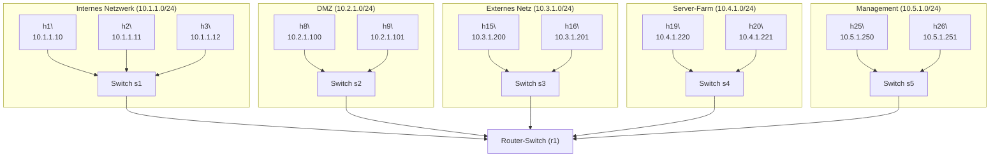

# SDN Deepdive: Enterprise-Netzwerk mit L3-Switch & Firewall

Dieses Projekt richtet sich an Studierende, Lehrende und SDN-Interessierte, die praxisnah die Möglichkeiten von Software Defined Networking (SDN) mit Mininet und POX erkunden wollen. Im Fokus stehen ein Layer-3-Switch mit zentraler Firewall und eine realistische Enterprise-Netzwerk-Topologie.

---

## Überblick & Zielsetzung

- **Ziel:** Realistische Enterprise-Topologie mit mehreren Sicherheitszonen (Büro, DMZ, Extern, Server, Management) und zentral gesteuerter Firewall-Logik.
- **Lernziele:**
  - Verständnis von SDN-Prinzipien (Trennung von Control & Data Plane)
  - Policy-Änderungen im laufenden Betrieb
  - Netzwerksegmentierung und Security durch zentrale ACLs

---

## Netzwerk-Topologie

**Grafische Übersicht:**



**Tabellarische Übersicht:**

| Zone         | Subnetz         | Hosts (Beispiel)         |
|--------------|-----------------|--------------------------|
| Intern       | 10.1.1.0/24     | h1, h2, h3               |
| DMZ          | 10.2.1.0/24     | h8, h9                   |
| Extern       | 10.3.1.0/24     | h15, h16                 |
| Server-Farm  | 10.4.1.0/24     | h19, h20                 |
| Management   | 10.5.1.0/24     | h25, h26                 |

---

## Dateien & Komponenten

- `l3_switch_with_firewall.py`: POX-Controller mit L3-Routing und zentraler Firewall-Logik
- `enterprise_network_topo.py`: Mininet-Topologie mit 5 Subnetzen und zentralem Router
- `firewall_help.py`: Beispiele und Hilfestellungen für Firewall/ACL-Regeln
- `enterprise_firewall_rules.py`: Enterprise-spezifische Sicherheitsrichtlinien

---

## Nutzung

1. **Mininet-Topologie starten:**
   ```sh
   sudo mn --custom deepdive/enterprise_network_topo.py --topo enterprise --controller=remote,ip=127.0.0.1,port=6633 --mac -x
   ```
2. **POX-Controller starten:**
   ```sh
   ~/pox/pox.py deepdive.l3_switch_with_firewall samples.pretty_log --DEBUG
   ```
3. **Hosts konfigurieren:**
   - Die Default-Gateways sind in der Topologie bereits gesetzt.
   - Prüfe mit `h1 route -n` etc.

---

## L3-Switch mit Firewall: Funktionsweise

- **IP-Routing** zwischen Subnetzen (jede Zone ist ein eigenes Subnetz)
- **ARP-Handling**: Automatische MAC-Auflösung, ARP-Cache
- **Firewall/ACL**: Zentrale Methode `_is_blocked_by_acl` prüft für jedes Paket anhand von Quell-/Ziel-IP, Protokoll und Port, ob es geblockt wird
- **Flow-Installation**: Erlaubte und geblockte Flows werden direkt auf dem Switch installiert (Effizienz, Logging)
- **MAC-Learning** für lokale Kommunikation

**Beispiel: Firewall-Regeln (aus `_is_blocked_by_acl`)**
```python
# HTTP zu DMZ erlauben
if dst == IPAddr("10.2.1.100") and proto == ipv4.TCP_PROTOCOL and dport == 80:
    return False
# Traffic aus externem Netz blockieren
if src.inNetwork("10.3.1.0/24"):
    return True
# SSH von intern zu DMZ blockieren
if src.inNetwork("10.1.1.0/24") and dst.inNetwork("10.2.1.0/24") and proto == ipv4.TCP_PROTOCOL and dport == 22:
    return True
# Standard: alles erlauben
return False
```

---

## Demo-Szenarien & Testfälle

| Testbefehl                  | Beschreibung                        | Erwartung           |
|-----------------------------|-------------------------------------|---------------------|
| h1 ping h2                  | Intern zu intern                    | Erlaubt             |
| h1 ping h8                  | Intern zu DMZ                       | Erlaubt             |
| h1 ssh 10.2.1.100           | Intern zu DMZ (SSH)                 | Blockiert           |
| h15 ping h8                 | Extern zu DMZ                       | Erlaubt             |
| h15 ping h19                | Extern zu Server-Farm               | Blockiert           |
| h25 ssh 10.5.1.251          | Management zu Management            | Erlaubt             |

Weitere Szenarien und Tipps findest du in `enterprise_firewall_rules.py` und `firewall_help.py`.

---

## Vorteile von SDN (für die Demo)

- **Zentrale Steuerung:** Eine Codezeile im Controller ändert das Verhalten des gesamten Netzes.
- **Dynamik:** Regeln können im laufenden Betrieb angepasst werden.
- **Effizienz:** Geblockte Flows werden direkt auf Switch-Ebene installiert (Drop-Flow).
- **Transparenz:** Logging und Flow-Table-Analyse ermöglichen gezieltes Troubleshooting.

---

## Hinweise zur Erweiterung & Troubleshooting

- **Eigene ACL-Regeln:** Ergänze oder ändere Regeln in `_is_blocked_by_acl` im Controller.
- **Debugging:** Nutze das Log (`--DEBUG`) und prüfe die Flow-Table (`dpctl dump-flows`).
- **Subnetz-Masken:** Achte darauf, dass die Subnetze in den Regeln zu den Host-IPs passen!
- **Reihenfolge:** Die erste passende Regel zählt. Schreibe spezifische Regeln zuerst, allgemeine zuletzt.
- **Protokoll-IDs:**
  - ICMP: `ipv4.ICMP_PROTOCOL`
  - TCP: `ipv4.TCP_PROTOCOL`
  - UDP: `ipv4.UDP_PROTOCOL`

---

## Didaktische Hinweise

- **Warum SDN?**
  - Policies und Security zentral und dynamisch steuern
  - Netzwerksegmentierung und -sicherheit realistisch simulieren
  - Ideal für Lehre, Workshops und Experimente
- **Empfohlene Übungen:**
  - Eigene Firewall-Policies entwerfen und testen
  - Unterschied L2/L3 Switch praktisch erleben
  - Live-Änderungen und deren Auswirkungen beobachten

---

## Weiterführende Dateien & Links

- `deepdive/firewall_help.py`: Viele weitere Regelbeispiele und Tipps
- `deepdive/enterprise_firewall_rules.py`: Enterprise-spezifische Policies und Demo-Szenarien
- [Mininet Doku](http://mininet.org/walkthrough/)
- [POX Doku](https://noxrepo.github.io/pox-doc/html/)

---

Mit dieser Umgebung kannst du SDN und Netzwerksicherheit realitätsnah und flexibel erleben. Viel Spaß beim Deep Dive! 🎓
